# devillage-training-iot-sensor-value-notificator

---

**devillage 5回目 IoT活用したスマートコントラクト**  
**「センサー値をスマートコントラクトで監視してブロックチェーン上に刻む**  
**閾値超えたらアラートを出す」** 用に用意したリポジトリです。

最初 wasm ベースで仕上げて、途中から solidity ベースを加えたので、  
ぐちゃっとしています。。。

## ～リポジトリのお品書き～

- astar-collator(開発用設定) コンテナ
- センサ値診断用スマートコントラクトプロジェクト(ink!)
- センサ値を通知する疑似 iot device コンテナ
- iot device 用[^1]スクリプトの例

[^1]: この例では python>=3.6 が動作する必要があります。

## 勉強会でやる内容

1. センサ値が大丈夫か診断する用のスマートコントラクトのビルド
2. 1 をastar-collator にデプロイしてみよう
3. 2 にセンサ値を送りつけてやろう

## 勉強会のゴール

1. スマートコントラクトをビルドできること
2. astar-collator ローカルノードにwasm スマートコントラクトをデプロイできること
3. 上記スマートコントラクトを python スクリプトで呼び出せること

## 事前準備

- [ink!](https://doc.rust-lang.org/cargo/getting-started/installation.html) のインストール

- docker-compose のインストール

- docker-compose の動作確認

## docker

docker で astar-collator を立ち上げる。

### 各コンテナの役割

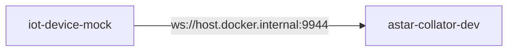

※ host.docker.internal はdocker コンテナ内のローカルネットワーク名

#### astar-collator

スマートコントラクトをデプロイするためのローカルノード。  
iot device からアクセスするため、外部からのアクセスを許可している。

#### iot-device-mock

センサ値を astar-collator にデプロイしたスマートコントラクトに  
通知する iot デバイスを模擬したもの。  
form からの入力値をセンサ値としてスマートコントラクトを呼び出す。

### 起動

以下のコマンドで環境を立ち上げる。

``` bash
cd ./docker
docker-compose up -d
```

### 終了

環境を終了させるには、以下のコマンドを実行する。

``` bash
cd ./docker
docker-compose down
```

## 実践

### 事前準備

使用する metamask アカウントの public key と private key を  
以下の場所に設定する。  
※使い捨て推奨  
※ 本当は Alice を使いたい。。。

./dcoker/iot-device-solidity-mock/app.py

```py
# TODO: chagnge for your wallet 
args["publicKey"] = "metamask public key"
args["privateKey"] = "metamask private key"
```

### スマートコントラクトのビルド & デプロイ

#### Solidity編(Remix経由)

以下の記事を参考してやってみる。  
以下の場所の smart_contract/solidity/sensor_diag.sol を使う。

https://zenn.dev/polonity/articles/72d51231165905#smart-contract-%E3%82%92%E3%83%87%E3%83%97%E3%83%AD%E3%82%A4%E3%81%99%E3%82%8B

デプロイ出来たら、Remix の画面からスマートコントラクトをいじることができる。

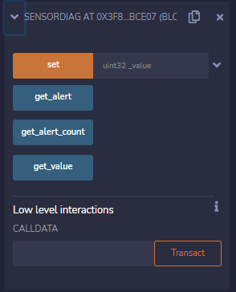  

今回使用する スマートコントラクトの ABI をいただいておく。  
赤枠を押下。

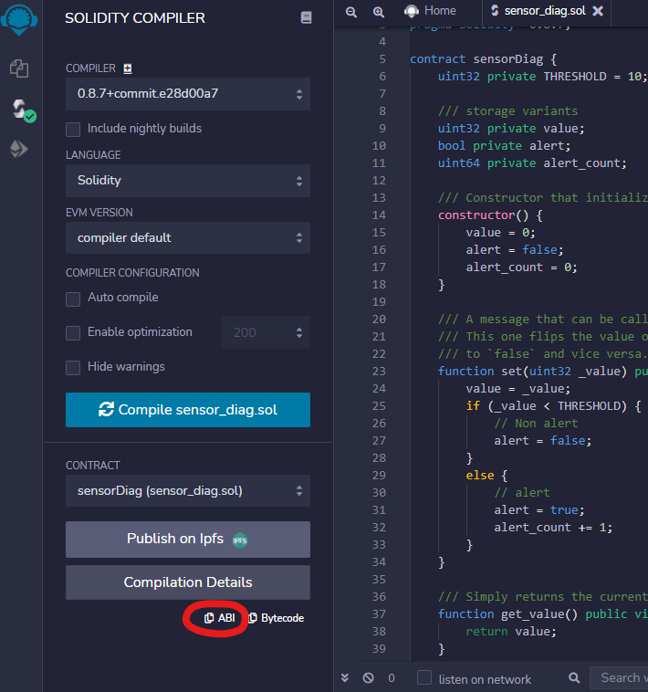  

コピーした内容で以下のファイルを書き換える。

- ./iot-device/solidity/assets/sensor_diag_abi.json  
- ./docker/iot-device-solidity-mock/assets/sensor_diag_abi.json


#### WASM 編

ink! をインストールした後、以下のコマンドでスマートコントラクトをビルドする。

``` bash
cd ./smart_contract/sensor_diag

# build ink! project
cargo +nightly contract build
```

以下が成果物。

```bash
./target/ink
  - sensor_diag.contract (code + metadata)
  - sensor_diag.wasm (the contract's code)
  - metadata.json (the contract's metadata)
```

今回使用するのは、 sensor_diag.contract と metadata.json 。  

metadata.json を以下のフォルダに配置する。わかりやすく rename しておく。

```shell
./docker/iot-device-mock/sensor_diag.json
```

### docker 環境の立ち上げ

1. docker-compose で環境を立ち上げる

    ``` bash
    cd ./docker
    docker-compose up -d
    ```

2. 以下のアドレスにアクセスして astar-collator に接続できるか確認する。
    <https://polkadot.js.org/apps/?rpc=ws%3A%2F%2F127.0.0.1%3A9944#/contracts>
    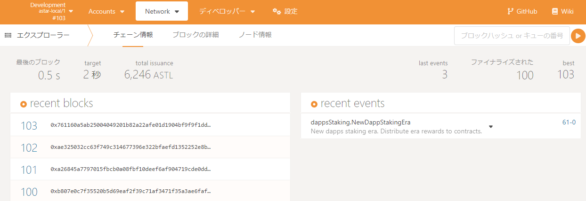  

3. 以下のアドレスにアクセスして iot-device-mock の動作を確認。
    - solidity   <http://localhost:8090/>
    - wasm       <http://localhost:9090/>
    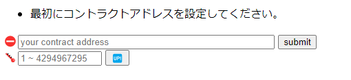  

### ※WASMのみ※スマートコントラクトのデプロイ

1. polkadot.js.org の画面を開き、「ディベロッパー」→「スマートコントラクト」を押下。
   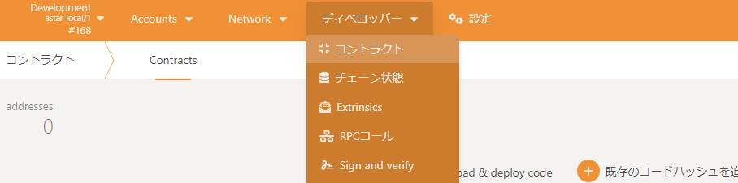  

2. Upload & deploy code を押下。
  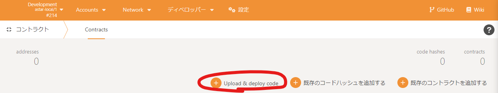  

3. 赤枠を押下し、 先ほどビルドした sensor_diag.contract を選択。
  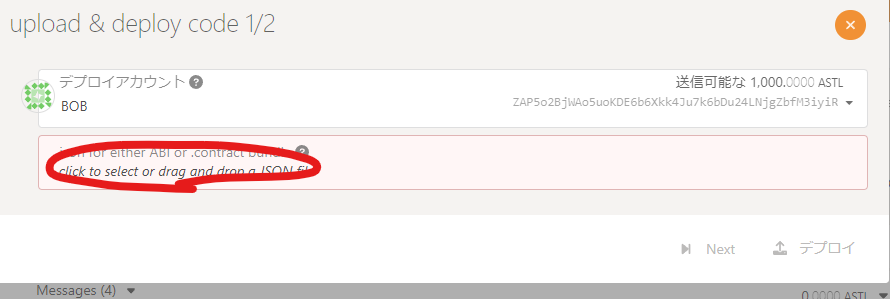
  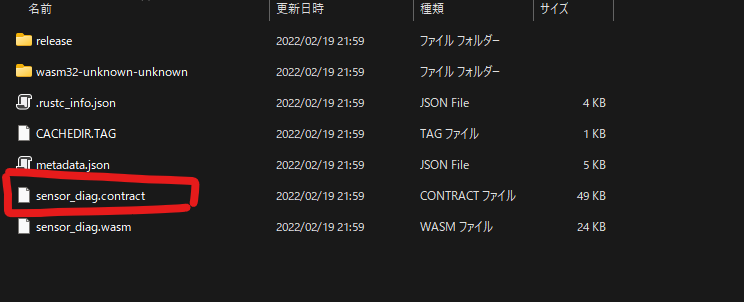

4. 「Next」 を押下。
   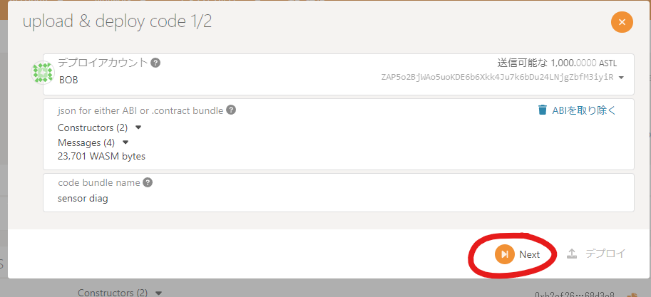  

5. 「デプロイ」を押下。
   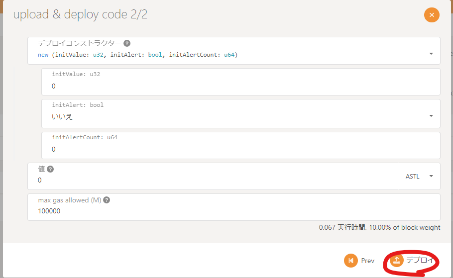  

6. 「Sign & Submit」 を押下。
   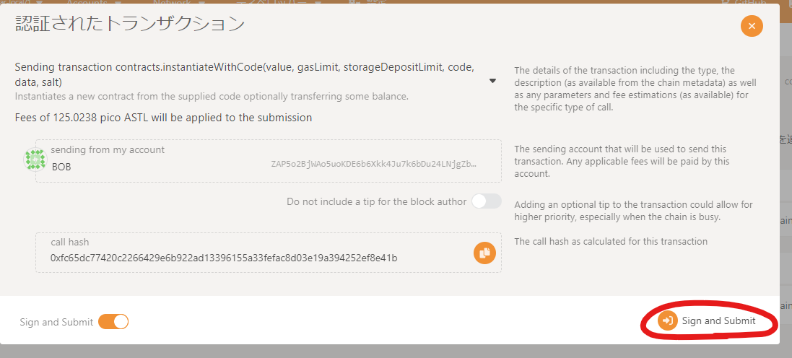  

7. 成功すると画面右側に Success と表示される。
  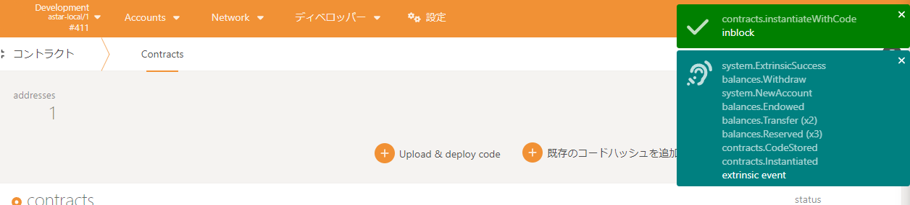  

以上をこなすと、以下の通りデプロイしたスマートコントラクトが表示される。

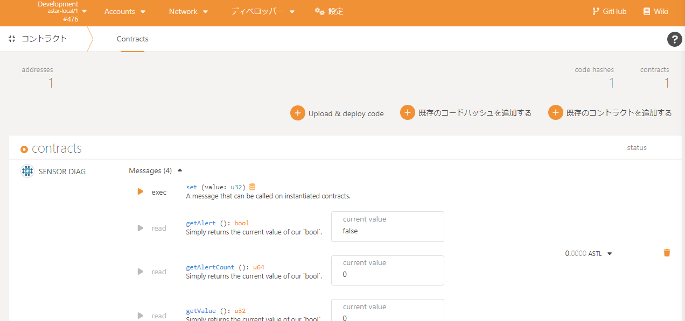  

### センサ値をスマートコントラクトに通知する

#### コントラクトアドレスの取得

#### solidity

1. polkadot.js.org の画面を開き、先ほどデプロイしたコントラクト名を押下。
     

2. 赤枠がコントラクトアドレスなので、コピーしておく。
   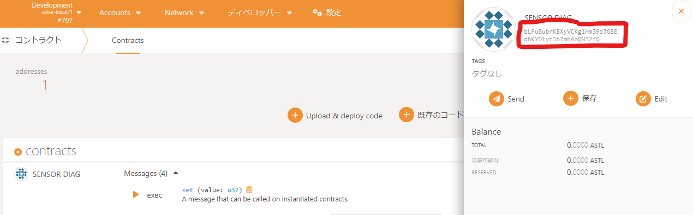  

#### wasm

1. 赤枠を押下してコピー。

   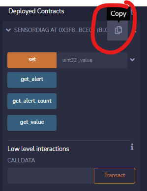  

#### コントラクトアドレスの設定

1. GUI にアクセスする。

   - solidity   <http://localhost:8090/>
   - wasm       <http://localhost:9090/>

2. コピーしたコントラクトアドレスを「your contract address」欄にペーストし、submit ボタンを押下する。
   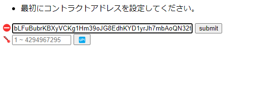
   ※例は WASM のスマートコントラクトアドレス。
   Remix デプロイ分は0x08A3dc850... みたいな感じになる。
   コントラクトアドレスがあっていれば、設定に成功する。
  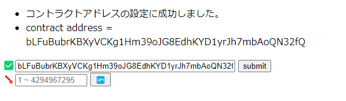  

3. その下の欄に思い思いのセンサ値を入力して「UP!」を押下する。
  センサ値の設定に成功すると、以下のように設定値とalert 状態が表示される。
  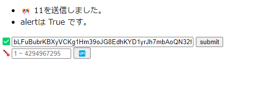  

#### センサ値をスマートコントラクトに通知した結果を確認する

polkadot.js.org 側の画面上の値も設定したセンサ値で更新されている。  
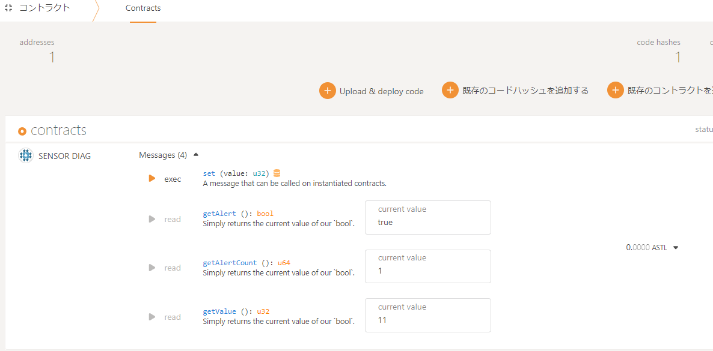  

wasm の場合。solidity の場合はトランザクションの形式が異なる。  
ブロックチェーン上も実行したスマートコントラクトと引数の値が刻まれている。  
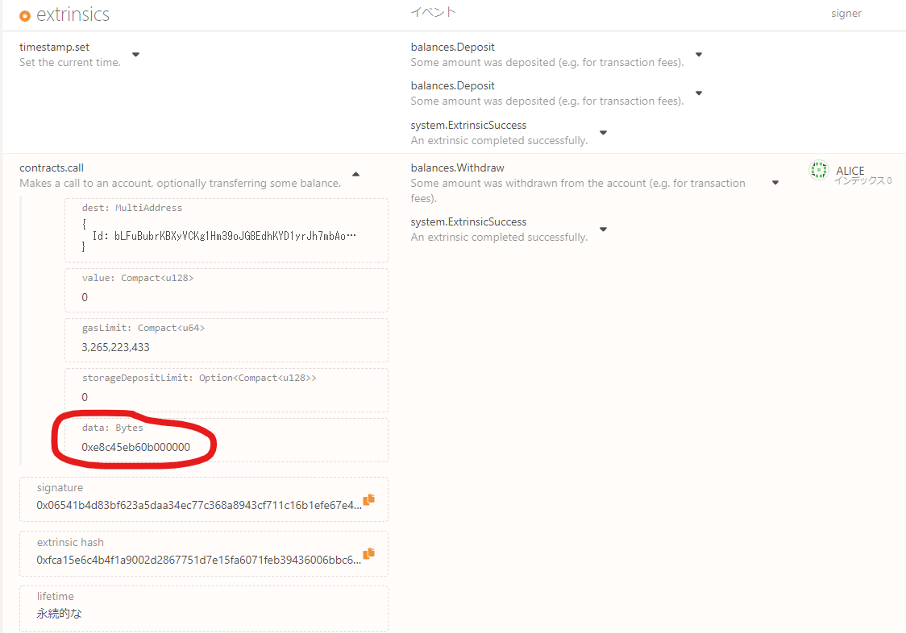  

　上位32bit が スマートコントラクトを呼び出す際のselector で、  
それ以降が args(u32: little endian) の値になっている。  
selector： 0xe8c45eb6  
args　　： 0b000000  

現場からは以上です。

#### 🔥頑張りたい人へ🔥iot device を使用する場合

##### solidity 編

普通に web3py(etherium に対するライブラリ) が使える。

1. コントラクトアドレスを設定する。

   赤枠を押下。

    

   ./iot-device/solidity/assets/device.json

   ```diff
   ・・・
   -        "address" : "",
   +        "address" : "<your contract address>",
   ・・・
   ```

2. metamask の public key private key を設定する。

   ./iot-device/solidity/assets/device.json

   ```py
      "publicKey": "metamask public key",
      "privateKey": "metamask private key",
   ```

満を持して、以下のコマンドでセンサ値を投げる(真似をする)。  

```shell
cd ./iot-device
python3 sensor_notify.py <センサ値>
```

##### wasm 編

substrate-interface を使用する。

1. iot device に python3 pip をインストールする。

    ```shell
    pip install python3 python3-pip -y
    ```

2. iot device に rust をインストールし、 default を nightly に設定する。

    ```shell
    curl https://sh.rustup.rs -sSf | sh
    rustup toolchain install nightly
    rustup default nightly
    ```

3. iot device に substrate-interface をインストールする。(1日くらいかかる)

    ```shell
    pip install substrate-interface
    ```

4. ./iot-device/script を iot-device に送る。
5. ./script/assets/device.json のコントラクトアドレスをデプロイしたアドレスに変更する。
6. 以下のようにコマンドを実行する。

   ```shell
   cd script
   python3 sensor_notify.py
   ```

これで、スマートコントラクトが実行されているのを確認できれば完了🎉
